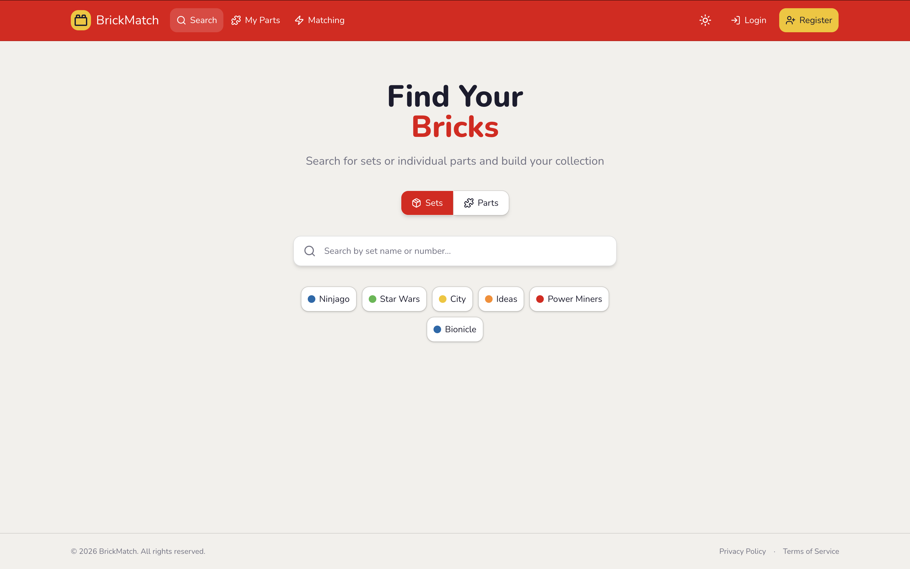
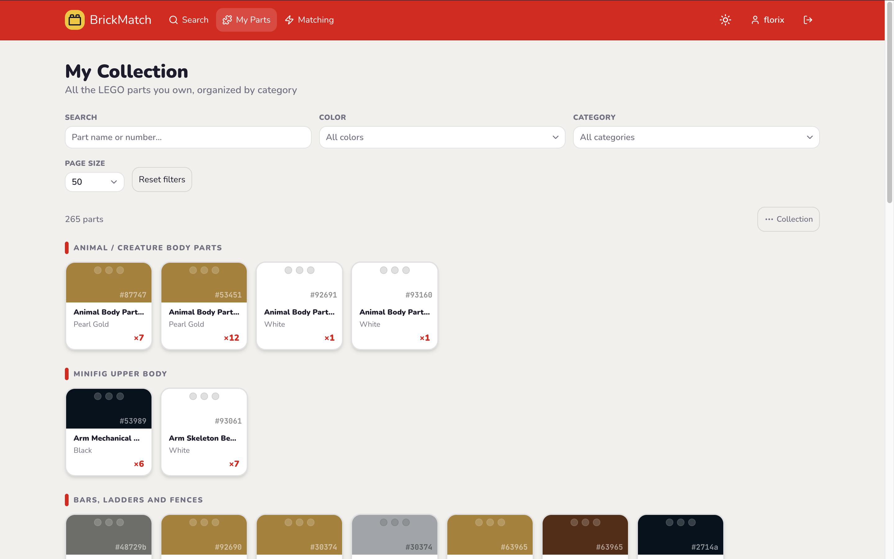
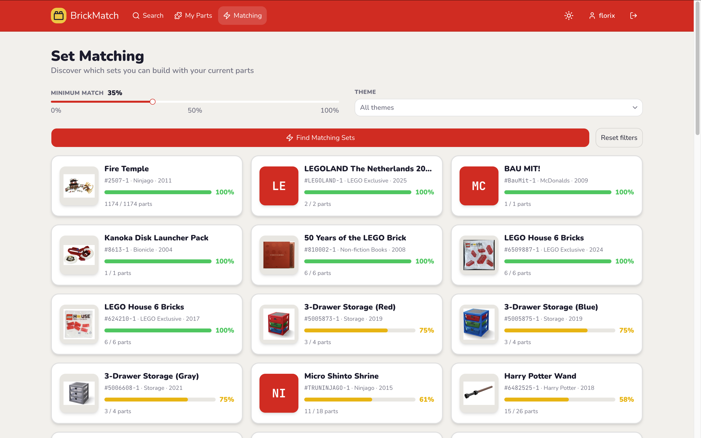

# 🧱 LEGO Set Matcher

> Find out which LEGO sets you can build from the parts you already own — and exactly what's missing to finish the rest.

Point it at your collection (by set number or piece by piece), and it tells you, out of every set Rebrickable knows about, which ones you're closest to completing and what to buy to get there.

---

## Why this exists

Most "LEGO inventory" tools solve one narrow slice of this problem, or solve it by scanning bricks with AI — which sounds great until you realize color/part recognition from a photo still isn't reliable enough to be trustworthy, and existing apps (Brickit, Rebrickable's own Build feature) already cover that ground.

This project deliberately isn't an AI wrapper. The interesting part is a **matching engine**: given an arbitrary set of owned parts, quickly find which of ~20,000+ sets in the catalog are worth pursuing, without brute-forcing the entire catalog on every request.

## How the matching actually works

The core problem: naively checking "do I have what set X needs?" against every set in the catalog is far too slow to do on demand. Two ideas make it fast:

1. **Candidate narrowing via a database index.** A B-tree index on `inventory_parts(part_num, color_id)` turns "which sets use any of my ~200 owned parts?" into a handful of indexed lookups instead of a full scan — narrowing ~20,000 sets down to a few hundred realistic candidates.
2. **A single aggregated query, not N queries.** Match percentage for every candidate is computed in one `GROUP BY` query with a `HAVING` clause filtering out near-zero matches (e.g. a set sharing one basic brick with your collection) before anything is sent back to the application — the database does the filtering, not a loop in Node.

```sql
SELECT ip.set_num,
       SUM(LEAST(COALESCE(o.quantity, 0), ip.quantity))::float / SUM(ip.quantity) AS match_percentage
FROM inventory_parts ip
LEFT JOIN owned o ON o.part_num = ip.part_num AND o.color_id = ip.color_id
WHERE ip.set_num IN (/* candidates from the index lookup */)
GROUP BY ip.set_num
HAVING SUM(LEAST(COALESCE(o.quantity, 0), ip.quantity))::float / SUM(ip.quantity) >= :threshold
ORDER BY match_percentage DESC;
```

## Features

- **Add parts two ways** — search and add a whole set (its inventory, including minifig-derived parts, gets expanded into your collection automatically), or add individual parts manually.
- **Matching results** — filterable by LEGO theme and by a minimum match-percentage threshold, so you don't drown in sets you share one brick with.
- **Missing parts export** — download a CSV in Rebrickable's own import format for any set; upload it to a Rebrickable Part List, then export that as BrickLink XML from there. (BrickLink and Rebrickable use different internal part/color IDs — routing through Rebrickable's own converter avoids building and maintaining that mapping ourselves.)
- **Auth** — email/password with argon2 hashing, JWT delivered via an `httpOnly` cookie, password-confirmation required for changing email/password/deleting the account.
- **Account & data deletion** — hard delete, no soft-delete state anywhere in the schema; deleting your account or your whole collection is immediate and irreversible by design.

## Screenshots




## Tech stack

`Next.js` · `NestJS` · `PostgreSQL` (`Neon`) · `Drizzle ORM` · `Zod` · `pnpm workspaces` · `TypeScript` throughout

**A few choices worth calling out:**
- **Zod over `class-validator`** — request/response schemas live in a shared `shared-types` package (pnpm workspace), imported by both the API and the frontend. One schema defines the type *and* the runtime validation; the same schema also drives frontend form validation. No `nestjs-zod` dependency either — Nest's own docs show the ~10-line custom `ZodValidationPipe` pattern, which is all this project needed.
- **Catalog data is never fetched live.** Rebrickable's CSV export is imported into Postgres up front (parts, sets, colors, themes, inventories); the app never calls a third-party API on the request path. The only deliberate, documented exception is a one-off script to resolve BrickLink color IDs, run manually and separately from the regular catalog import.
- **Hard-bounded vs. unbounded data is treated differently on purpose.** Small fixed reference tables (colors, themes — a few hundred rows, never grow) are fetched whole and cached client-side, no pagination. A user's own collection has no natural cap and grows with usage, so it's genuinely paginated — that's a correctness requirement there, not just a performance nicety.

## Project structure

```
lego-matcher/
├── api/                 NestJS — REST API, matching engine, catalog import
├── web/                 Next.js — UI
├── shared-types/        Zod schemas + inferred TS types, shared between api and web
└── pnpm-workspace.yaml
```

## Getting started

```bash
pnpm install

# Build the shared types package first — api/web consume its compiled output
pnpm --filter @lego-matcher/shared-types build

# Import the LEGO catalog (downloads and parses the Rebrickable CSV export)
pnpm --filter api import:catalog

pnpm --filter api start:dev
pnpm --filter @lego-matcher/web dev
```

Requires a Postgres connection string (`DATABASE_URL`) — developed against [Neon](https://neon.tech).

## Data & trademark attribution

Catalog data (sets, parts, colors, themes, inventories) is sourced from [Rebrickable](https://rebrickable.com).

LEGO® is a trademark of the LEGO Group, which does not sponsor, authorize, or endorse this project.

## License

MIT